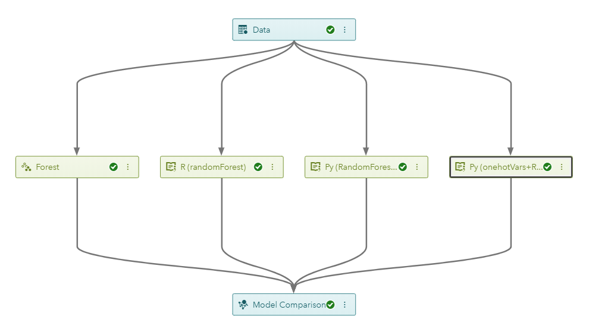

## Simple Forest in SAS, Python and R

Data: [UCI Machine Learning Repository, Default of credit card clients](https://archive.ics.uci.edu/ml/datasets/default+of+credit+card+clients#)

Data Description: The data contains information about customer's default payments in Taiwan. It contains 30,000 observations with one ID variable, one target (or response) variable indicating default payment (Yes=1, No=0) and 23 input (or explanatory) variables. In other words, it has a binary target and a mix of numeric and categorical inputs. The categorical inputs like sex, education, marriage etc. are numeric and there are no missing values in this data.

### Steps to run this example
1. Download "default of credit card clients.xls" file from UCI link above and save it as comma separated or CSV file.

2. Drop/delete the first row labels X1, X2, X3, ... (as the second row has labels too) from CSV file.

3. Rename the last column "default payment next month" to "default_next_month" in CSV file.

4. Log into SAS Visual Data Mining & Machine Learning 8.3, choose "Build Models" (Model Studio) and create a new project; select the above CSV file as data source with default options.

5. Under Data tab, select default_next_month as target variable.

6. Under Pipelines, create a simple pipeline as shown below using Forest and Open Source Code nodes. After adding Open Source Code node, right-click and select Move >> Supervised Learning.

(**NOTE:** If the data has missing values, consider adding Imputation node before Open Source Code node)

7. Select first Open Source Code node, this builds randomForest in R:
   - Change "Language" property to R
   - Under Data Sample, change "Number of observations" to 50,000 so full data is used
   - Click Open button and copy code from sf_randomforest.r into the code editor
   - Click Save and close the editor

8. Select second Open Source Code node, this builds scikit-learn RandomForestClassifier in Python:
   - Under Data Sample, change "Number of observations" to 50,000 so full data is used
   - Click Open button and copy code from sf_sklearn_randomforest.py into the code editor
   - Click Save and close the editor
   
9. Select third Open Source Code node, this builds scikit-learn RandomForestClassifier in Python after one-hot encoding categorical variables:
   - Under Data Sample, change "Number of observations" to 50,000 so full data is used
   - Click Open button and copy code from sf_onehotvars_sklearn_randomforest.py into the code editor
   - Click Save and close the editor   
   
(**NOTE:** You can rename the nodes to "R(randomForest)", "Py(RandomForestClassifier)" and "Py(onehotVars+RandomForestClassifier)" by right-clicking on the node and selecting Rename)

9. Run the pipeline 

10. From Model Comparison node, right-click and select Results to view comparison of forest models from SAS, Python and R.

(NOTE: The forest models are built with 100 trees and defaults provided in respective software packages are used for other model parameters)

Other Resources:
- [Executing Open Source Code in SAS Visual Data Mining & Machine Learning Pipelines (video)](https://youtu.be/VSryf7qJi1g)
- [Open Source Code node documentation](https://go.documentation.sas.com/?cdcId=vdmmlcdc&cdcVersion=8.3&docsetId=vdmmlref&docsetTarget=n0gn2o41lgv4exn17lngd558jcso.htm&locale=en)
- [SAS Visual Data Mining and Machine Learning 8.3: User's Guide](https://go.documentation.sas.com/?cdcId=vdmmlcdc&cdcVersion=8.3&docsetId=vdmmlug&docsetTarget=titlepage.htm&locale=en)